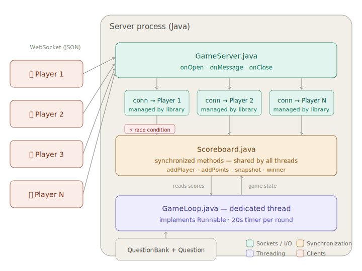

# 🎮 QuizBlitz

A real-time multiplayer quiz game built in Java. Players join from their phones by scanning a QR code, answer timed questions, and compete for the top score.

**OS concepts demonstrated:** Sockets, Multithreading, Shared Memory, Process Synchronization

---

## Architecture



---

## How it works

1. One team member runs `GameServer.java` on their laptop
2. The server prints a URL and QR code to the console
3. Players scan the QR code → phone opens the game in a browser
4. Players enter a name and tap "Join"
5. Once enough players join, rounds begin automatically
6. Each round: a question appears on all screens, 20 seconds to answer
7. After all rounds, the winner is revealed

All devices must be on the same Wi-Fi network.

---

## File structure

```
CS4440-Final-Project/
├── README.md                      ← you are here
├── SETUP.md                       ← step-by-step setup checklist
├── architecture.svg
├── pom.xml                        ← Maven config (dependencies, build)
├── .gitignore
│
├── docs/                          ← specs for each file / role
│   ├── GameServer.md
│   ├── GameLoop.md
│   ├── Scoreboard.md
│   ├── QuestionBank.md
│   ├── index.md
│   └── Presentation.md
│
└── src/
    └── main/
        ├── java/
        │   └── quizblitz/         ← all .java files go here
        │       └── GameServer.java
        └── resources/
            └── web/
                └── index.html
```

Each `.md` file in `docs/` is a specification for one file or role. Read the one assigned to you — it tells you what fields, methods, and message types you're responsible for.

**Note:** Dependencies (Java-WebSocket, org.json) are managed by Maven via `pom.xml`. You don't need to download any JARs manually — see `SETUP.md`.

---

## Message protocol

All messages between server and clients are JSON strings over WebSocket. Every message has a `type` and a `data` field.

### Client → Server

| Type | Data | When sent |
|---|---|---|
| `join` | `{ "name": "Jonas" }` | Player taps "Join" |
| `answer` | `{ "questionId": 1, "choice": "B" }` | Player taps an answer |

### Server → Client

| Type | Data | When sent |
|---|---|---|
| `welcome` | `{ "name": "Jonas" }` | Join confirmed |
| `waiting` | `{ "count": 3, "needed": 6 }` | Waiting for more players |
| `question` | `{ "id": 1, "text": "...", "choiceA": "...", "choiceB": "...", "choiceC": "...", "choiceD": "..." }` | New round starts |
| `timer` | `{ "secondsLeft": 15 }` | Every second during a round |
| `round_end` | `{ "correct": "B", "scores": { "Jonas": 100, "Alex": 0 } }` | Timer hits zero |
| `game_over` | `{ "winner": "Jonas", "finalScores": { ... } }` | All rounds done |

**Important:** Everyone must parse and produce messages in this exact format. If your JSON keys don't match, integration will break.

---

## Development phases

### Phase 1 — Skeleton (do together) ✅

Build the minimum viable connection as a group.

**What got built:**
- `GameServer.java` with a WebSocket server that echoes messages back
- A barebones `index.html` that connects and shows the echo

**Done when:** Open `index.html` in a browser, connect to `ws://localhost:8080`, type something, see it on screen.

Push to GitHub. Everyone clones.

### Phase 2 — Build in parallel

Each person works on their files independently. Read your spec in `docs/` for full details.

| Person | Role | Files / Deliverables | How to test alone |
|---|---|---|---|
| A | Server lead | `GameServer.java` (Phase 2 logic — JSON routing, broadcasting) | Phase 1 `index.html` + raw JSON messages. Stub Scoreboard that just prints. |
| B | Frontend lead | `index.html` (5 screens, message handling, styling) | Mock incoming messages in JS. No real server needed. |
| C | Concurrency | `Scoreboard.java` | Temp `main()` spinning up threads calling `addPoints`. No sockets. |
| D | Game engine | `GameLoop.java` | Temp `main()` with fake players. Replace broadcast with `println`. |
| E | Content + data | `Question.java`, `QuestionBank.java`, write 10+ OS-themed quiz questions, define scoring rules | Temp `main()` that prints the question bank as JSON. |
| F | Integration + presentation | QR code helper, HTTP server (port 8081), slide deck, demo script, integration testing | See `docs/Presentation.md` |

**Key rule:** Each person writes a temporary `main()` in their own class that simulates the parts they don't have yet. Nobody waits on anyone.

### Phase 3 — Integration (everyone present)

1. Pull all code into one project
2. Wire `GameServer` → `Scoreboard` → `GameLoop`
3. Run server, connect 2+ devices, play a full game
4. Fix what breaks (usually JSON format mismatches or timing bugs)

Person F leads this phase — running the full game flow, filing issues for what breaks, coordinating fixes.

### Phase 4 — Polish and present

- Add code comments explaining OS concepts
- Verify the QR code flow works end-to-end
- Build the presentation slides
- Assign who presents which layer (each person presents the file they wrote)
- Do a dry run

---

## Quick reference: who calls what

```
GameServer.onMessage()
  ├── "join"   → scoreboard.addPlayer()
  └── "answer" → gameLoop.checkAnswer()
                   └── if correct → scoreboard.addPoints()

GameLoop.run()
  ├── checks scoreboard.playerCount()
  ├── broadcasts questions via gameServer.broadcastToAll()
  ├── Thread.sleep(20_000)
  ├── broadcasts round results via scoreboard.snapshot()
  └── broadcasts game over via scoreboard.winner()
```

---

## Concepts cheat sheet

If any of these terms are unfamiliar, here's the short version.

**`synchronized`** — A Java keyword that locks a method so only one thread can run it at a time. If Thread A is inside a `synchronized` method, Thread B has to wait until Thread A finishes. This prevents two threads from corrupting shared data.

**`volatile`** — A Java keyword for a variable that multiple threads read. It guarantees every thread sees the most recent value, not a stale cached copy. Lighter than `synchronized` but only works for simple reads/writes.

**`Runnable`** — A Java interface with one method: `run()`. You write your thread's logic inside `run()`, then pass it to `new Thread(yourRunnable).start()`. This is how we create threads in this project.

**`WebSocket`** — A protocol that keeps a two-way connection open between a server and a client (browser). Unlike regular HTTP (send request → get response → done), WebSocket lets the server push messages to the client at any time. The Java-WebSocket library handles the low-level details.

**`HashMap`** — A Java data structure that stores key-value pairs. In our project, `Scoreboard` uses `HashMap<String, Integer>` to map player names to their scores. Fast lookups, but not thread-safe by default — that's why we add `synchronized`.

**Race condition** — A bug that happens when two threads try to read and write the same data at the same time. Example: Player A and Player B both answer correctly at the same instant. Without synchronization, the score might only increment once instead of twice.

**Maven** — A build tool that handles dependencies and compilation. The `pom.xml` file declares what libraries we need (like Java-WebSocket), and Maven downloads them automatically. Saves us from emailing JAR files around.
